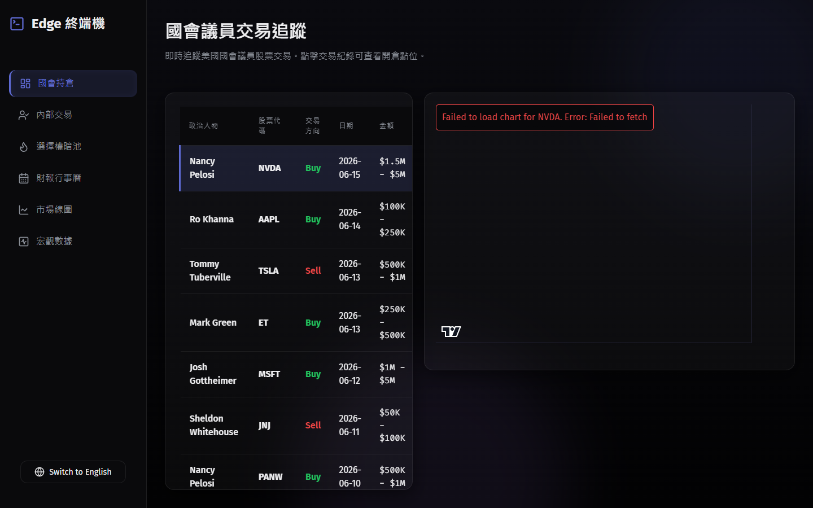

# Edge Terminal



## Overview

📥 **[Download Windows Installer (EXE)](https://github.com/U38572331/edge-terminal/releases/download/v2.0.0/Edge-Terminal-Setup-2.0.0.exe)**

Edge Terminal is an institutional-grade, cross-platform financial trading dashboard built with React, Vite, and Electron. Designed to simulate a high-end proprietary trading terminal, it delivers real-time market data visualization, options flow analysis, and corporate insider tracking in a highly optimized, aesthetically refined Glassmorphism interface.

## Core Capabilities

- **Institutional Options Flow & Dark Pool Analysis**: Real-time simulation of unusual options sweeps and deep-liquidity block trades, utilizing dynamic color coding to distinguish aggressive market-maker sentiment.
- **Corporate Insider & Congressional Trading Tracker**: Live parsing and visualization of executive Form 4 filings and U.S. Congressional stock disclosures, integrated directly with historical entry-point markers on K-line charts.
- **Global Ticker Search Engine**: Direct integration with the Yahoo Finance Autocomplete API, enabling instantaneous retrieval of 5-year candlestick data for any globally listed equity or index.
- **Macroeconomic & Earnings Intelligence**: Integrated forward-looking calendars tracking pivotal corporate earnings and crucial macroeconomic indicators.
- **Bilingual Architecture**: Built-in, zero-latency internationalization (i18n) supporting English and Traditional Chinese seamlessly across the entire application interface.

## Tech Stack

- **Framework**: React 18 / Vite
- **Desktop Environment**: Electron
- **Charting**: Lightweight Charts (TradingView)
- **Data Integration**: Yahoo Finance API (REST)
- **Styling**: Vanilla CSS / CSS Modules (Glassmorphism UI Paradigm)

## Installation & Build

Ensure you have Node.js (v18+) installed.

```bash
# Clone the repository
git clone https://github.com/yourusername/edge-terminal.git

# Navigate to the project directory
cd edge-terminal

# Install dependencies
npm install

# Run locally in browser
npm run dev

# Build the Electron desktop executable
npm run electron:build
```

---

# Edge Terminal (繁體中文)

## 專案概述

📥 **[下載 Windows 安裝檔 (EXE)](https://github.com/U38572331/edge-terminal/releases/download/v2.0.0/Edge-Terminal-Setup-2.0.0.exe)**

Edge Terminal 是一套採用 React、Vite 與 Electron 建構的機構級跨平台金融看盤終端機。專為模擬頂級自營交易室終端機而設計，結合即時市場數據視覺化、選擇權資金流分析與企業內部交易追蹤，並搭載高度優化且具備現代美感的擬玻璃透視 (Glassmorphism) 使用者介面。

## 核心功能

- **機構選擇權資金流與暗池分析**：即時模擬異常選擇權掃單 (Options Sweeps) 與深度流動性鉅額交易，採用動態色彩編碼技術精準判別市場造市商的積極情緒。
- **企業內部人士與國會交易追蹤**：即時解析美國企業高層申報 (Form 4) 與國會議員持倉披露，並與 K 線圖系統深度整合，將交易開倉點位精準映射至歷史走勢圖上。
- **全球股票代碼搜尋引擎**：直接串接 Yahoo Finance Autocomplete API，支援毫秒級搜尋全球上市企業與指數，並瞬間渲染五年期互動式 K 線圖。
- **宏觀經濟與財報前瞻**：內建前瞻性行事曆系統，專職追蹤關鍵企業財報發布與影響市場走向的重大宏觀經濟指標。
- **雙語架構系統**：內建零延遲國際化 (i18n) 模組，全應用程式介面皆支援英文與繁體中文的無縫切換。

## 技術架構

- **前端框架**：React 18 / Vite
- **桌面端環境**：Electron
- **圖表引擎**：Lightweight Charts (TradingView)
- **數據串接**：Yahoo Finance API (REST)
- **樣式設計**：Vanilla CSS / CSS Modules (擬玻璃透視 UI 設計)

## 安裝與編譯指南

請確保您的系統已安裝 Node.js (v18+)。

```bash
# 複製專案原始碼
git clone https://github.com/yourusername/edge-terminal.git

# 進入專案目錄
cd edge-terminal

# 安裝依賴套件
npm install

# 在本地端瀏覽器執行
npm run dev

# 編譯 Electron 桌面端執行檔
npm run electron:build
```

## License
MIT License
